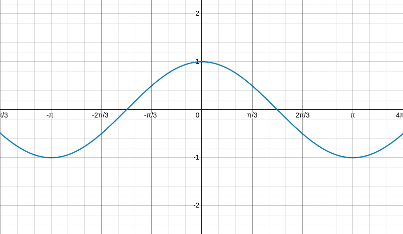
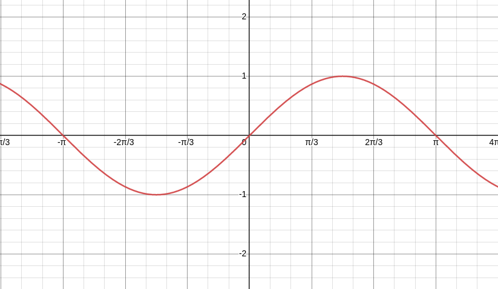
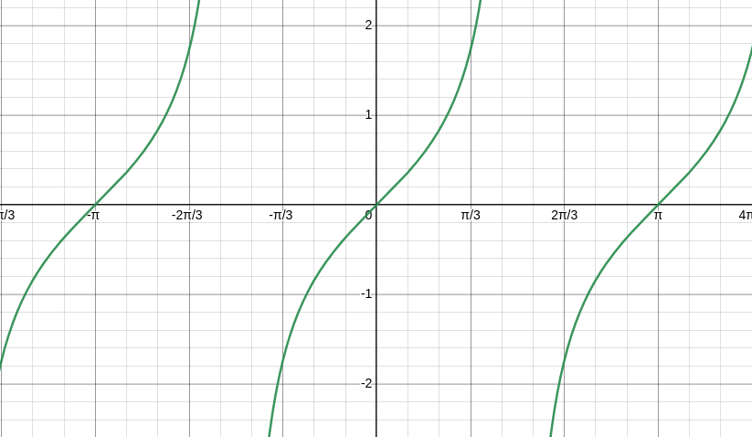
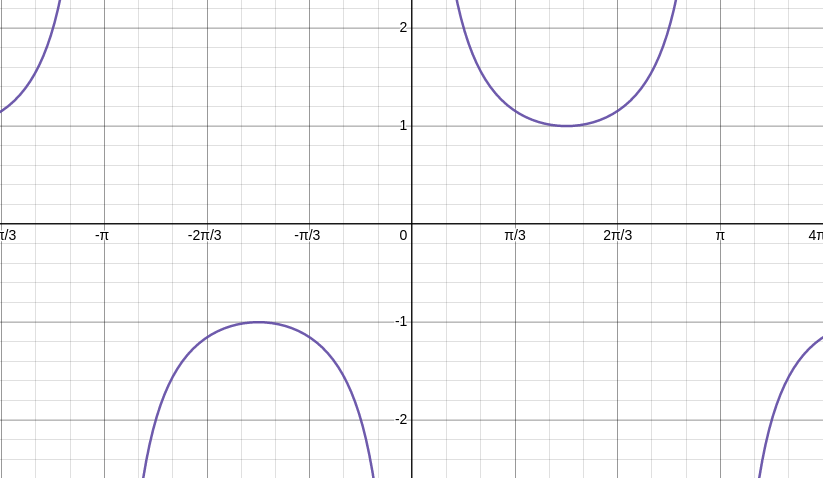
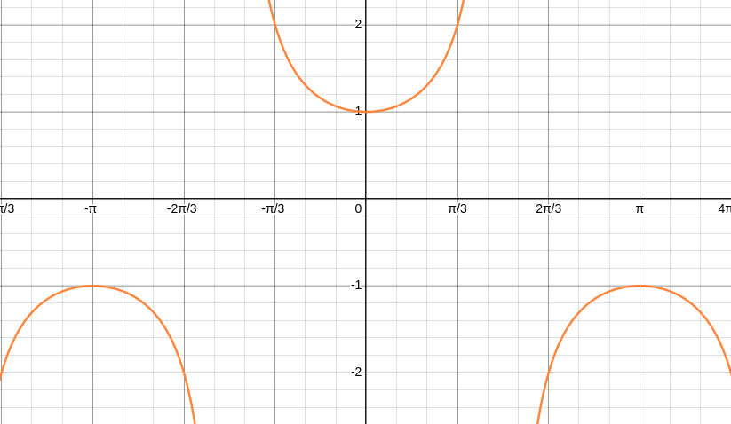
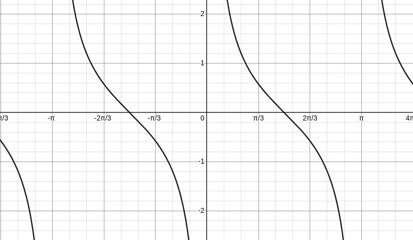

# Trigonometry 1060 Chapter 2

## Review
* Pythagorean Theorem: 
    * **a^2 + b ^2 = c^2**
## Conversions
---
* Convert degrees to radians
    * **θ = α(π/180)**
        * α = the angle in degrees
* Convert radians to degrees
    * **θ = α(180/π)**
        * α = the angle in radians

## Measurements
---
 * Arc Length - the length that subtends the angle
    * **r(θ)**
        * where θ is the angle in radians
        * !important if the length is in degrees you must first convert it to radians with the method mentioned above

## Angle Definitions
---
* π (pi) 
    * the angle π is a straight line
* co-terminal angles
    * co-terminal angles, θ and α, are co terminal if 
* supplementary angles 
    * supplementary angles, θ and α, are supplementary if their sum is π or 180 degrees
* right angle
    * an angle is a right angle if it is π/2 or 90 degrees.
    * a right triangle is similar, if two sides of a π/2 or 90 degrees it is considered a right triangle.
* coordinate angels
    * coordinate angles are angles where the terminal side lies on one of the axis
* acute angles
    * Acuate angles are angles that fall below π/2 or 90 degrees
* obtuse angle
    * an angle is obtuse if the angle is greater then π/2 (90 degrees) and less then π (180 degrees)
* 
## Degrees Minutes Seconds
* when writing an angle in degrees we can write the angle in decimals or in degrees minutes and seconds whish is a base representation after the decimal point. 
    * to convert from degree, minute, second format to decimals we use the following procedure 
        * if an angle has *n* degrees, *m* minutes, and *s* seconds then the decimal representation the angle is 
            * ***n + (m/60) + (s/3600)***
    * to convert from decimal to degree, minute, second, format  if the angle is listed as having n.d1d2d3... degrees than it still has n degrees in the new format the number of seconds is the digits of the product 60(d1d2d3...) before the decimal of the digits of 60(d1d2d3...). after the decimal point are m1m2m3... then you multi this decimal by 60 again to get the number of seconds 60(m1m2m3...).

## Velocity
---
* Angular Velocity - how fast the angle is moving for given amount 
    * **θ/t** - where t = time
        * you can think of it as the angle is moving at theta degrees per the alloted amount of time
* Linear Velocity - how far it is moving in a linear direction
    * **S/t**
        * S = the arc length or the length subtending the angle
        * t = time

## Trigonometric Functions
---
* sin(θ) - (sine)
    * **opposite/hypotenuse**
* cos(θ) - (cosine)
    * **adjacent/hypotenuse**
* tan(θ) - (tangent)
    * **opposite/adjacent** 
    * **sin(θ)/cos(θ)**
* sec(θ) - (secant)
    * **is the reciprocal of cos(θ)**
    * **1/cos(θ)**
* csc(θ) - (cosecant)
    * **is the reciprocal of sin(θ)**
    * **1/sin(θ)**
* cot(θ) - *(cotangent)*
    * **adjacent/opposite**
    * **cos(θ)/sin(θ)**
> you can remember everything above with the following mnemonic **SOHCAHTOA**

* We define the other trig functions (from sin, cos, and tan) to be the usual ratios of sine and cosine at angles which are not positive acute angles if those ratios are defined.
    * specifically
        * tan(θ) = (y/x) = sin(θ)/cos(θ) = 1/cot(θ)
        * cot(θ) = (x/y) = cos(θ)/sin(θ) = 1/tan(θ)
        * sec(θ) = 1/cos(θ)
        * csc(θ) = 1/sin(θ)

## Trigonometric Graphs
---
* When graphing a trig function we can keep the following equation in mind
    * **f(x) = a(trig func(b(x) - c) + d**
        * a = the amplitude that the graph will reach also known as vertical dilation
            * if a is negative then the graph will be reflected over the x axis
        * b = (2π/b) the new period of the graph also known as horizontal translation by default it is 2π
            * if b is negative then the graph will be reflected over the y axis
        * c = the phase shift (horizontal translation)
        * d = the vertical shift (sinusoidal axis) (midline)

* cos(θ)

* sin(θ)

* tan(θ)

* csc(θ)

* sec(θ)

* cot(θ)

## Wrapping Function
we can also use wrapping functions where we define W(t)to be the point on the unit circle we end at if we move counter clock wise a distance t along the unit circle from the point (1, 0). if the point we end at is W(t) = (x, y) then x = cos(t) and sin(t) since we don't have a convenient expression for the terminal (x, y) except in terms of cosine and sine of the angle, however this description is not especially useful when determining the values of the trig functions, so the procedure we use tends to involve reference angles.

# Standard Reference Angles

* an angle that is in standard position if the initial side is the non-negative axis

    * standard ref angles
        
        | θ     | sin(θ)       | cos(θ)       |
        | ----- | ------------ | ------------ |
        | 0     | 0            | 1            |
        |  π/6  | 1/2          | $\sqrt{3}$/2 |
        |  π/4  | $\sqrt{2}$/2 | $\sqrt{2}$/2 |
        |  π/3  | $\sqrt{3}$/2 | 1/2          |
        |  π/2  | 1            | 0            |